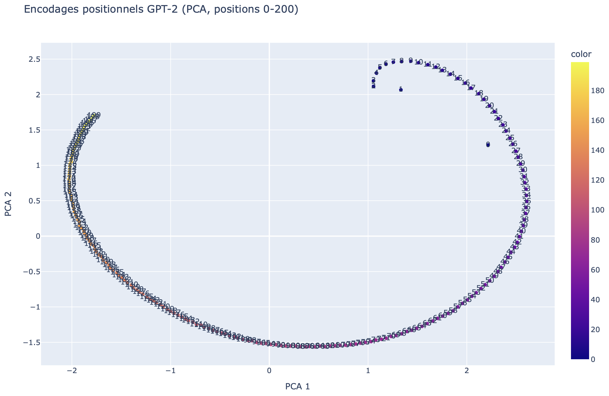
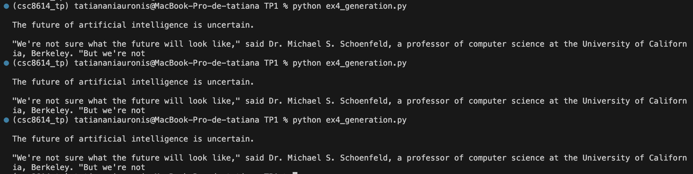

# **rapport.md — TP1 Modèles de langage**
NIAURONIS Tatiana – FIPA 3A  
CSC8614 – TP1

---

## **Exercice 1 — Rendu (GitHub) et rapport Markdown — à lire avant de commencer**

### **Question 1.a/b**

**Reproductibilité**

```bash
conda create -n csc8614_tp python=3.10
conda activate csc8614_tp
pip install -r requirements.txt
```
OS: macOS 14.3.1 (arm64)
Python : 3.10.19
torch : 2.4.1
transformers : 4.57.3
numpy : 1.26.4
pandas : 2.3.3
plotly : 6.5.1
scikit-learn : 1.7.2
Seed fixé : 42
  
---

## **Exercice 2 — Découverte du tokenizer GPT-2**

### **Question 2.a**

On obtient:

```
(csc8614) tatiananiauronis@MBP-de-tatiana TP1 % python ex1_tokenizer.py 
['Art', 'ificial', 'Ġintelligence', 'Ġis', 'Ġmet', 'amorph', 'osing', 'Ġthe', 'Ġworld', '!']
```

Certains tokens commencent par un symbole spécial `Ġ` car GPT-2 utilise une byte-level BPE donc le tokenizer marque l'espace au début de ce mot avec un symbole spécial. Par exemple  `Ġword` correspond à ` word` (avec l'espace au début). 


### **Question 2.b**

On a:

| Token (décodage) | Token ID | Remarque                |
| ---------------- | -------: | ----------------------- |
| `Art`            |     8001 | Début de mot            |
| `ificial`        |     9542 | Suite de mot (sous-mot) |
| ` intelligence`  |     4430 | Espace + mot            |
| ` is`            |      318 | Espace + mot            |
| ` met`           |     1138 | Espace + sous-mot       |
| `amorph`         |    37670 | Sous-mot                |
| `osing`          |     2752 | Suffixe                 |
| ` the`           |      262 | Espace + mot            |
| ` world`         |      995 | Espace + mot            |
| `!`              |        0 | Ponctuation             |

Les tokens sont des suites de caractères produites par le tokenizer. Les token IDs sont les identifiants (entiers) associés à ces tokens. Le modèle GPT-2 ne manipule que les IDs (qui sont dans le vaocabulaire du modèle).

### **Question 2.c**

Les mots peuvent être découpés en plusieurs sous-mots comme `Artificial` qui donne `Art` + `ificial` ce qui réduit la taille du vacabulaire car il est découpé en deux sous-mots assez communs et fréquents. Les espaces sont intégrés aux tokens par exemple ` the` ce qui permet au modèle d’identifier les débuts de mots. La ponctuation (!) est traitée comme un token séparé. On peut aussi voir des mots entiers très communs comme `world`.

### **Question 2.d**

On obtient pour le mot long:

```
[' ant', 'idis', 'establishment', 'arian', 'ism']
```

On obtient 5 sous-tokens. Ce mot est long et peu fréquent dans les données d’entraînement. Le tokenizer GPT-2 basé sur le Byte Pair Encoding (BPE) le découpe donc en plusieurs sous-mots plus fréquents tels que des préfixes (ant et idis), des racines (establishment) et des suffixes (arian et ism). Cela permet de représenter efficacement des mots rares sans les stocker comme tokens uniques. 

---

## **Exercice 3 — Analyse des encodages positionnels dans GPT-2**

### **Question 3.a**

On a comme sortie du programme:

```
Shape position embeddings: torch.Size([1024, 768])
n_embd: 768
n_positions: 1024
```
La 1ère dimension n_positions correspond au nombre de positions possibles (index 0 à n_positions-1) et la 2e dimension n_embd correspond à la dimension de l’espace d’embedding.

`n_positions` représente la longueur maximale de contexte que GPT-2 peut prendre en entrée (nombre maximum de tokens pris en compte). 

### **Question 3.b**


Les positions 0 à 50 forment une trajectoire continue dans l’espace en 2D. La structure n’est pas aléatoire car on observe une forme de courbe régulière donc une certaine organisation, les points se suivent. 

Les encodages positionnels sont initialement en dimension 768 ce qui n’est pas visualisable directement. La PCA permet de réduire la dimension à 2 afin d’analyser visuellement la structure globale des positions.

### **Question 3.c**



Avec les positions 0–200, la structure devient plus étendue et ressemble à une boucle. La trajectoire est plus longue et moins lisible localement sur la gauche avec plus de points qui se chevauchent. 

On peut penser que les encodages positionnels appris par GPT-2 contiennent à la fois une information locale et une structure globale. Lorsque l’on augmente le nombre de positions visualisées, la projection 2D mélange davantage des positions.

---

## **Exercice 4 — Probabilités et génération de texte avec GPT-2**

### **Question 4.a**

On obtient:

```
1 'ificial' 1.920e-05
2 ' intelligence' 1.504e-01
3 ' is' 1.955e-01
4 ' fascinating' 6.504e-04
5 '.' 1.773e-01
```

GPT-2 est un modèle causal donc à la position i, le modèle prédit le token suivant (i+1) à partir des tokens vus jusque-là. C'est pour cette raison qu'on ne voit pas `Art`. Donc la probabilité du token observé à la position t se lit dans la distribution produite au pas t−1.

Ici on peut voir qu'avoir `ificial` après `Art` a une faible probabilité alors qu'avoir `is` derrière `intelligence` est plus probable.

### **Question 4.b**

Ici, on obtient:

```
total_logp: -23.4549400806427
avg_neg_logp: 4.69098801612854
perplexity: 108.96078165213443
```

La perplexité mesure à quel point le modèle ne s'attendait pas à la phrase. Elle est calculée à partir de la moyenne des log-probabilités conditionnelles des tokens donc si le modèle donne des probabilités élevées aux tokens observés, la perplexité est faible. Et si le modèle trouve la séquence improbable, les probabilités conditionnelles sont faibles et la perplexité devient grande. 

### **Question 4.c**

On a pour les deux phrases:

```
Phrase: 'Artificial intelligence is fascinating.'
total_logp: -23.4549400806427
perplexity: 108.96078165213443

Phrase: 'Artificial fascinating intelligence is.'
total_logp: -42.16449689865112
perplexity: 4595.805780644026
```

La perplexité est beaucoupe plus élevée (4595) pour la deuxième phrase car l’ordre des mots est inversé et beaucoup moins probable selon les régularités apprises par GPT-2. GPT-2 a été entraîné sur des textes en anglais donc il attribue des probabilités plus élevées aux phrases "normales". Mais la 2e phrase ne correspond pas aux règles grammaticales courantes donc plusieurs tokens deviennent très improbables ce qui augmente fortement la perplexité.

### **Question 4.d**

Pour la phrase française on a:

```
Phrase FR: "L'intelligence artificielle est fascinante."
total_logp: -59.48139953613281
perplexity: 383.04020348763044
```

La perplexité en français est plus élevée que pour la phrase anglaise correcte ce qui monytre que GPT-2 est plus à l’aise en anglais. En effet, ses données d’entraînement contiennent majoritairement de l’anglais  et les séquences françaises sont donc moins probables ce qui augmente la perplexité.

### **Question 4.e**


Les 10 propositions sont:

```
' a' 1.205e-01
' the' 5.254e-02
' not' 4.324e-02
' an' 3.092e-02
' now' 2.062e-02
' one' 1.890e-02
' also' 1.880e-02
' already' 1.716e-02
' becoming' 1.606e-02
' just' 1.422e-02
```

Les propositions sont plausibles .Toutes commencent par un espace (' a', ' the') ce qui est logique. De plus, on n'a pas de point final dans les propositions. 

---

## **Exercice 5 — Exploration des méthodes de génération avec GPT-2**

### **Question 5.a**

Le seed fixé est de 42. On le fixe car on veut rendre les résultats reproductibles.

### **Question 5.b**



Oui, c’est identique parce que le greedy decoding choisit à chaque étape le token le plus probable. Il n’y a pas de tirage aléatoire donc relancer le script produit la même suite de phrase.

### **Question 5.c**

On a:

```
SEED 1
The future of artificial intelligence is up in the air, and the future of artificial intelligence is now about to change. For now, we're just waiting for the technology to be perfected so that we can take it to the next level. 

The
----------------------------------------
SEED 3
The future of artificial intelligence is bright and bright. The future of the Internet of Things, and the future of the future of the Internet of Things industry.

The future of the Internet of Things, and the future of the Internet of Things industry
```

Par rapport au greedy, le sampling produit des textes beaucoup plus divers donc changer le seed change la suite de la phrase. Certaines suites restent cohérentes (SEED 2) mais d’autres montrent des répétitions (SEED 3 “bright and bright” et "future of", SEED 4 "very very"). Le greedy est plus stable et généralement plus cohérent mais donne une seule suite la plus probable. Le sampling permet d’explorer plusieurs suites mais augmente le risque de répétition et d’incohérences.

La température (0.7) réduit un peu l’aléatoire donc plus elle diminue plus les résultats sont déterministes et se rapproche du greedy, top-k limite le choix aux 50 tokens les plus probables à chaque étape et top-p conserve le plus petit ensemble de tokens dont la probabilité atteint 0.95.

### **Question 5.d**

Avec la pénalité on a:

```
The future of artificial intelligence is up in the air, and it may not be as interesting or useful to us humans. But we're going down a path where our ability for thinking about things could become less important than ever before."
```

Et sans la pénalité on a:

```
The future of artificial intelligence is up in the air, and the future of artificial intelligence is now about to change. For now, we're just waiting for the technology to be perfected so that we can take it to the next level.

The
```

Ici avec la pénalité, on réduit la répétition notemment de "the future of artificial intelligence".

### **Question 5.e**

Pour une température basse de 0.1:

```
The future of artificial intelligence is uncertain. But the future of artificial intelligence is not.

The future of artificial intelligence is not.

The future of artificial intelligence is not.

The future of artificial intelligence is not.

The
```

Pour une température haute de 2.0:

```
The future of artificial intelligence is up in the air again in 2014 as Google unveils its new platform called MachineStory-AI called Watson from the Stanford Institute for Artificial Intelligence (SetBorg). For IBM and for everyone trying to get their heads in
```

Avec une température basse (0.1), le modèle privilégie les tokens les plus probables donc ici on a des répétitions très marquées de "The future of artificial intelligence is not". Avec une température élevée (2.0) la diversité augmente mais la cohérence baisse, avec des suites moins contrôlées (ici on a plein d'universités, entreprises qui s'accumulent).

### **Question 5.f**

```
The future of artificial intelligence is in the hands of the next generation of scientists and engineers.

The future of artificial intelligence is in the hands of the next generation of scientists and engineers.

The future of artificial intelligence is in the hands of
```

Ici, on voit que le beam search donne une sortie plus probable, plus générique et moins diverse que le sampling. On voit la répétition de la même phrase en boucle. Comparé au greedy, c’est déterministe et comparé au sampling, c’est moins varié. On a donc une répétition car le beam favorise les séquences probables.

### **Question 5.g**

```
num_beams=5 time_sec=6.695616722106934
The future of artificial intelligence is in the hands of the next generation of scientists and engineers.

The future of artificial intelligence is in the hands of the next generation of scientists and engineers.

The future of artificial intelligence is in the hands of
----------------------------------------
num_beams=10 time_sec=8.456289052963257
The future of artificial intelligence is in the hands of the next generation of scientists and engineers.

The future of artificial intelligence is in the hands of the next generation of scientists and engineers.

The future of artificial intelligence is in the hands of
----------------------------------------
num_beams=20 time_sec=11.104417562484741
The future of artificial intelligence is in the hands of the next generation of scientists and engineers.

The future of artificial intelligence is in the hands of the next generation of scientists and engineers.

The future of artificial intelligence is in the hands of
----------------------------------------
```

On retrouve les mêmes phrases que précédemment. Plus num_beams est grand, plus on a de chemins à explorer. C’est pourquoi le temps augmente quand on passe de 5 à 10 puis à 20 beams car on a plus de calculs par étape.


