# **rapport.md — TP4 Modèles de langage**
NIAURONIS Tatiana – FIPA 3A  
CSC8614 – TP4

---

## **Exercice 1 — Démarrage d'Ollama (local ou cluster)**

### **Question 1.h**

Ollama tourne bien:

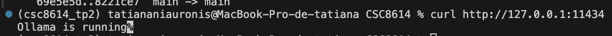

Le port qu'on a choisi ici est le port 11435 avec `export OLLAMA_PORT=11435`. On le voit bien avec la commande `printenv`:

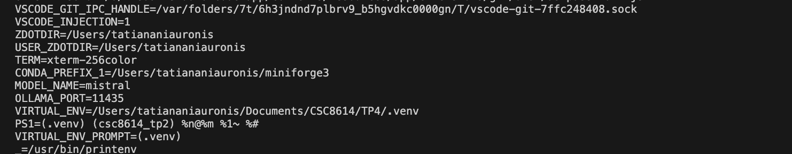

Le run donne:

```
(csc8614_tp2) tatiananiauronis@MacBook-Pro-de-tatiana CSC8614 % ollama run ${MODEL_NAME} "Réponds en français : donne 3 avantages du RAG."
 Le Réseau d'Aide aux Gens (RAG) présente plusieurs avantages pour les personnes qui le 
rejoignent :

1. Soutien et assistance : le RAG offre un soutien émotionnel et pratique aux personnes en 
difficulté, à travers des réunions mensuelles, des activités sociales et de soutien, ainsi 
que des conseils et des ressources utiles.
2. Solidarité et amitié : en rejoignant le RAG, les personnes ont l'opportunité d'entrer en 
contact avec des gens qui partagent leurs expériences et leur situation, ce qui permet de 
construire de fortes relations et de sentir que la communauté est derrière elles.
3. Participation et action : en tant qu'organisation non gouvernementale (ONG), le RAG permet 
aux personnes de s'engager dans des actions pour faire avancer les droits des personnes 
vivant avec un handicap et d'améliorer la vie des personnes à travers la défense de leurs 
intérêts collectifs.
```

---

## **Exercice 2 — Constituer le dataset (PDF administratifs + emails IMAP) et installer les dépendances**

### **Question 2.b**

On a bien téléchargé les PDF administratifs et créé la bonne structure:

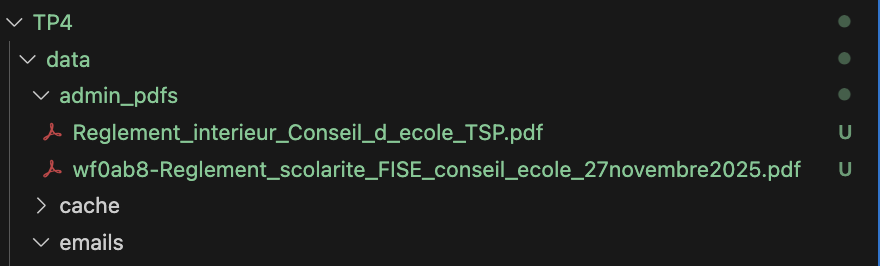

### **Question 2.d**

Ona bien lancé le script et on affiche le nombre de fichiers crées:

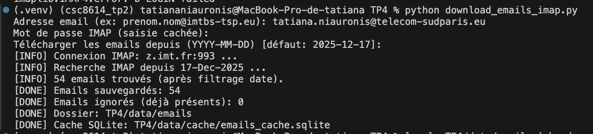

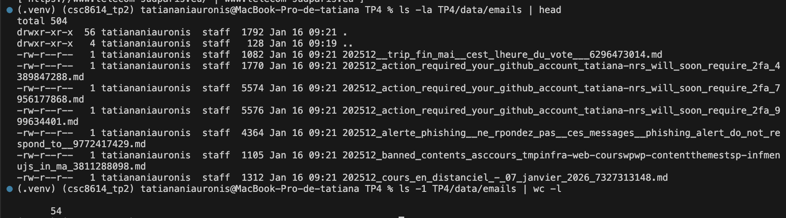

On peut voir que 54 emails ont été sauvegardés.

Si on regarde le contenu d'un mail avec head on a:

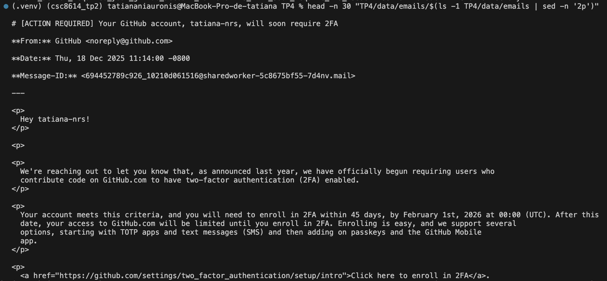

---

## **Exercice 3 — Indexation : charger PDFs + emails, chunker, créer l’index Chroma (persistant)**

### **Question 3.e**

La sortie de la console montre:

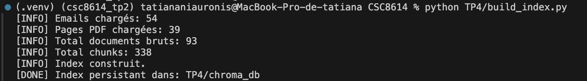

On peut voir les 54 emails chargés et les 39 pages PDF chargées pour un total de 338 chunks.

L'index a bien été créé:

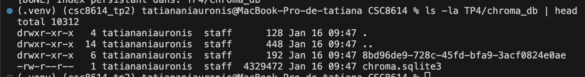

---

## **Exercice 4 — Retrieval : tester la recherche top-k (sans LLM) et diagnostiquer la qualité**

### **Question 4.d**

Oui les 3 premiers chunks contiennet laa réponse avec le modèle `EMBEDDING_MODEL = "nomic-embed-text-v2-moe"`. Les chunks sont partiellement redondants car les réponses 3, 4 et 5 proviennet de la même source PDF (règlement). Mais ici, la réponse est en première donc ce n'est pas problématique et nous n'avons que deux documents PDF. Le type de document est logique car un email est la source attendue pour les sujets de PFE proposés par Luca Benedetto et un règlement pour la validation.

### **Question 4.e**

On a exécuté cette commande:

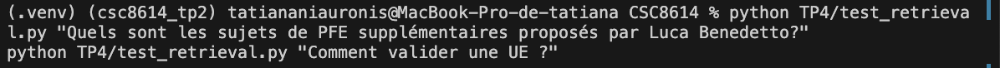

On a obtenu ces trois premières réponses pour la première question:

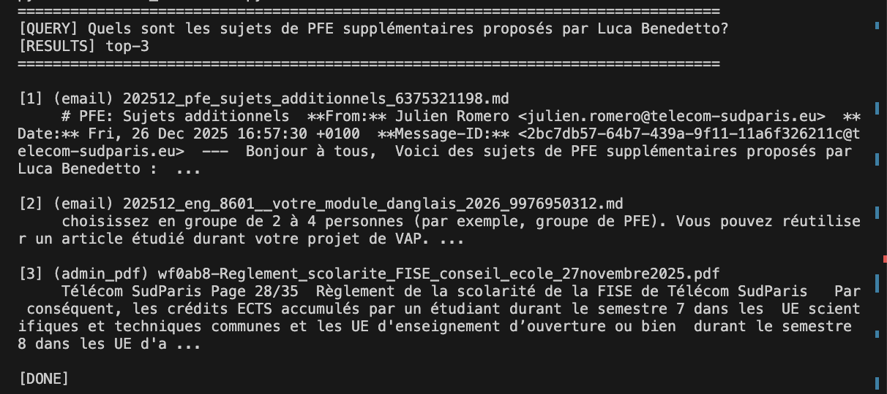

Pour la deuxième question, on obtient:

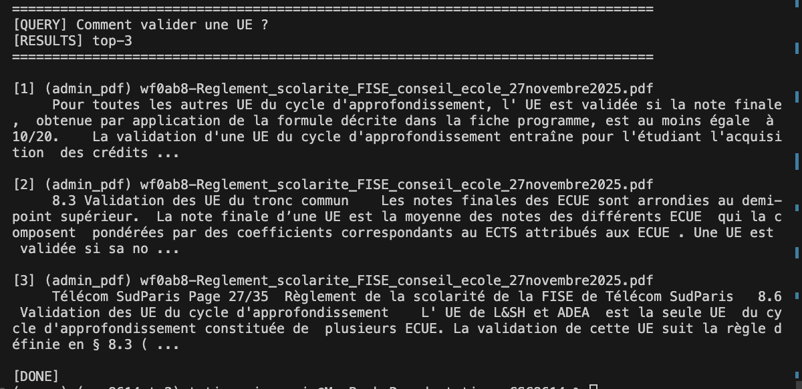

La valeur du TOP_K utilisée est ici 3 comme on peut le voir ci-dessus également.

---

## **Exercice 5 — RAG complet : génération avec Ollama + citations obligatoires**

### **Question 5.c/d**

La réponse est bien en français les citations apparaissent bien. On a rendu le prompt plus strict car le système halucinait et ne déclenchait pas l'abstention pour la question sur la météo.

### **Question 5.e**

On obtient: 

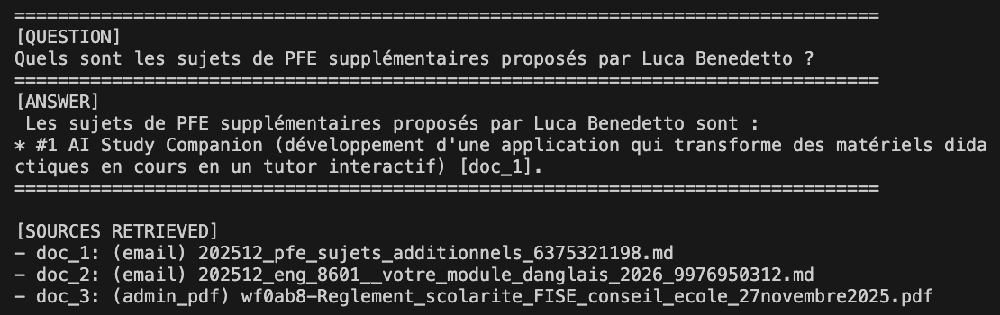

La réponse est en français, on a la citation et la source principale est l’email 202512_pfe_sujets_additionnels_...md (doc_1), ce qui est logique correct. Ici la réponsê n'extrait qu'un seul sujet alors que le mail en contient deux. 

On a aussi: 

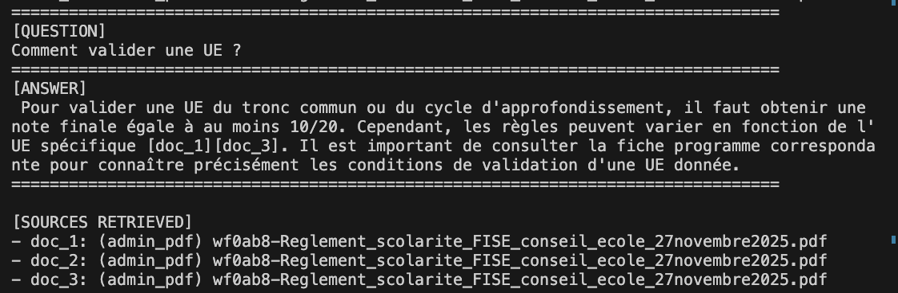

La répons est aussi en français et on a bien les sources citées ici le règlement de FSE ce qui est attendu. 

Enfin, pour le test de robustesse, on a :

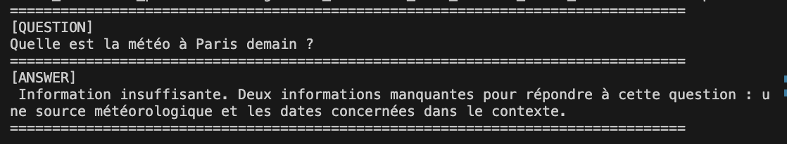

Le système déclenche bien l’abstention car on a “Information insuffisante.” qui apparaît. Dans notre cas, le modèle proposait avant des recommandations externes (consulter une météo) ce qui n’est pas autorisé car hors contexte. Pour limiter cela, on a fait un prompt plus strict et in a utilisé un TOP_K faible (3) pour limiter les chunks non pertinents dans le contexte.

---

## **Exercice 6 — Évaluation : créer un mini dataset de questions + mesurer Recall@k + analyse d’erreurs**

### **Question 6.e**

On obtient :

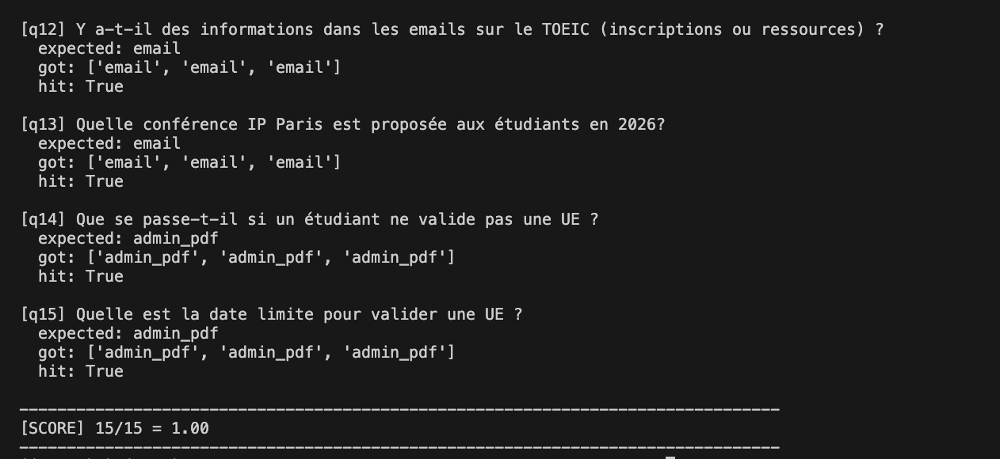

On a un score de 100% ce qui indique que pour l’ensemble des questions, le retriever a identifié un document pertinent du bon type dans les trois premiers résultats.

### **Question 6.f**

On obtient: 

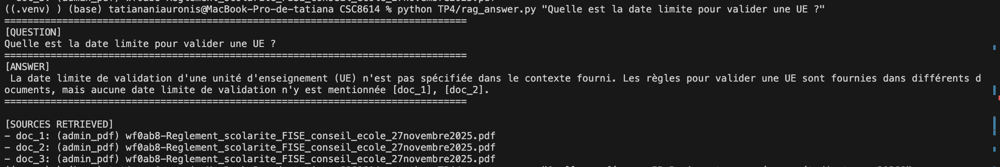

On peut y associer un score de 2/2 car le système indique que la date limite n’est pas spécifiée dans le contexte récupéré avec les citations présentes [doc_1], [doc_2]. Ainsi, la réponse évite d’inventer une date et précise que les documents ne contiennent pas cette information.

Aussi, on a: 

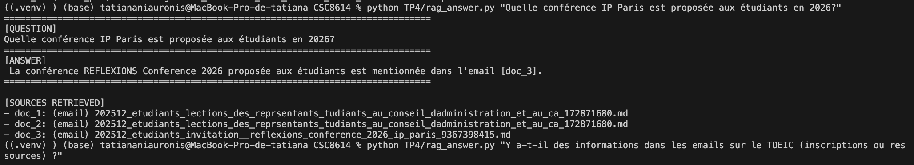

On peut y associer un score de 1/2 car le système pointe bien l’email pertinent [doc_3] et identifie “REFLEXIONS Conference 2026” mais il ne donne pas les détails concrets (date, lieu, modalités, lien, contenu) alors qu’ils sont dans l’email.

Enfin:

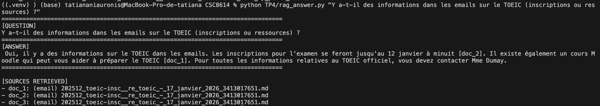

On lui associe un score de 2/2 car il y'a les citations et le système donne une date limite et indique une ressource.

### **Question 6.g**

Pour cette question on obtient:

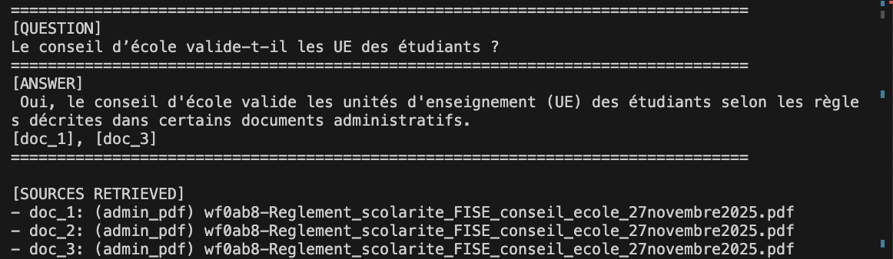

La réponse est affirmative mais sans preuve dans le contexte, elle déduit une réponse qui est fausse car non présente dans les documents. C'est un cas d'hallucination ici. 

C'est une question piège car elle pousse à une réponse logique alors que le document parle de règles de validation pas du rôle du conseil d’école. Le prompt n'est peut etre pas assez strict.

Ou encore:

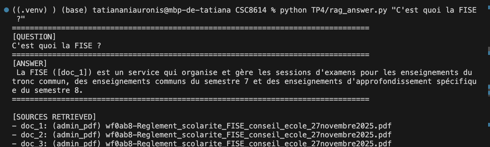

Ici la question demande une définition mais le chunk dit juste ce que fait la FISE et ne le définit pas. Ici, on peut aussi rendre le prompt plus strict encore une fois.


### **Question 6.h**

Mon fichier de questions est:

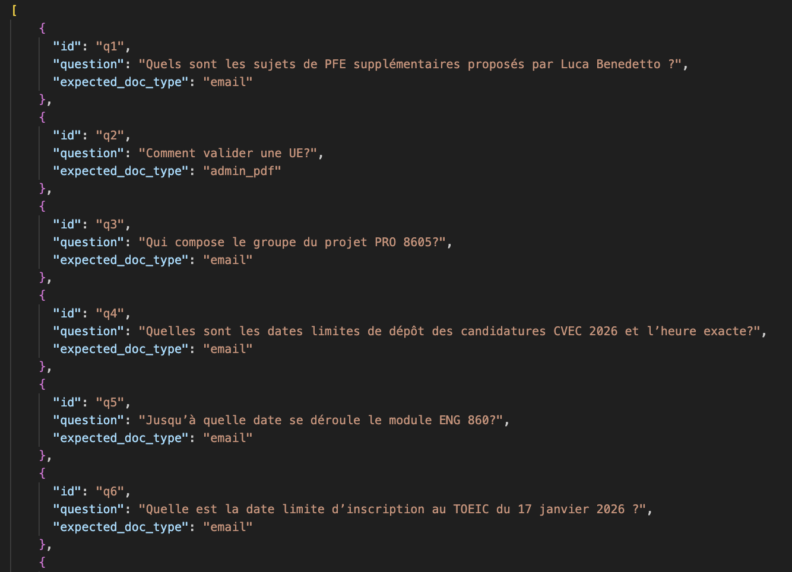

Voir questions précédentes.

### **Question 6.i**

Le système fonctionne bien, le retrieval identifie bien le type de document attendu (emails ou admin_pdf) avec un bon score et les réponses générées sont majoritairement pertinentes et correctement sourcées. Le mécanisme d’abstention est efficace et évite les hallucinations lorsque l’information demandée n’est pas présente dans le corpus. La principale limite rencontrée concerne les questions demandant des informations très précises (décisions explicites comme le fait qu'il est déduit une réponse qui n'est pas dans les documents PDF) qui ne figurent pas directement dans les documents. Une amélioration pour un déploiement réel serait d’enrichir le corpus (ajout de documents) car nous n'avons que deux documents PDF et d’affiner le chunking pour produire des preuves plus ciblées. 


